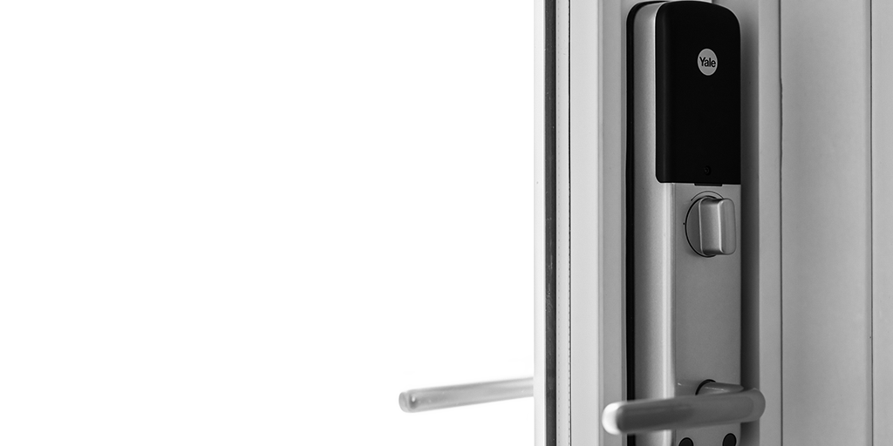

# homeassistant-yale-doorman-via-smarthub
A Home Assistant integration to control a Yale Doorman lock via the Yale Smart Hub.
So far only tested on a single Yale Doorman V2N.

> **This is a fork** of [jockesyk/homeassistant-yale-doorman-via-smarthub](https://github.com/jockesyk/homeassistant-yale-doorman-via-smarthub),
> which remains the original project and its owner. This fork exists to carry debug
> logging and bug fixes (see `CHANGELOG.md`) while they're not yet in upstream.
> Consider starring/supporting the original repo if this integration is useful to you.



# Debug logging
This fork adds detailed debug logging to help diagnose connection issues with the Yale smarthub
(e.g. entities going `unavailable`). To enable it, add this to `configuration.yaml` and restart
Home Assistant:

```yaml
logger:
  default: info
  logs:
    custom_components.yale_doorman_via_smarthub: debug
```

Then check **Settings > System > Logs** (or `home-assistant.log`) for lines from
`custom_components.yale_doorman_via_smarthub`. Look for:
- `hub.login file not found` - the bundled auth file is missing/unreadable.
- `Login failed` / `HTTP 401` or `403` on the `/o/token/` request - bad username/password or Yale
  has rotated the API credentials this integration relies on.
- `Timeout` or `Error fetching information` - the `mob.yalehomesystem.co.uk` backend isn't
  reachable from your network, or Yale's API is down.
- `HTTP 5xx` with a response body - Yale's backend is erroring server-side.

# Thank You
<a href="https://www.buymeacoffee.com/jockesyk" target="_blank"></a><br>